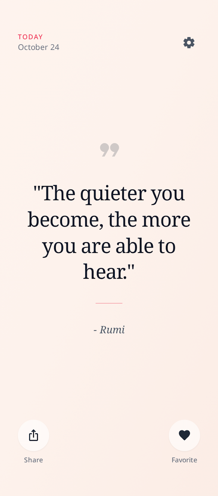
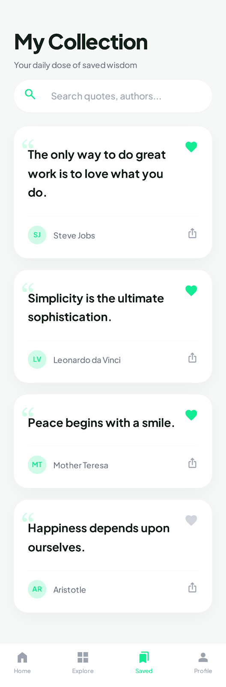

# DailyQuoteApp
This project was built to demonstrate proficiency in AI-assisted software development.


A minimalist, aesthetic iOS application that delivers daily wisdom. Built using **SwiftUI** and an **AI-first workflow**.

## 📱 Features
* **Daily Inspiration:** Fetches random quotes from the [ZenQuotes API](https://zenquotes.io/).
* **Favorites Collection:** Save quotes to your personal collection (persisted locally).
* **Share Wisdom:** Share quotes directly to Instagram, Messages, or other apps via the iOS Share Sheet.
* **Calm Aesthetic:** A pastel peach/mint UI designed to reduce stress.

## 🤖 AI Workflow & Tools
This project was built to demonstrate proficiency in AI-assisted software development.

**Tools Used:**
* **Stitch (by Google):** Used to generate the "Calm Pastel" UI designs and initial HTML/CSS structure.
* **Cursor (with Gemini 1.5 Pro):** Used as the primary IDE for writing SwiftUI code, refactoring MVVM logic, and debugging.

**My Approach:**
1.  **Design Generation:** I prompted Stitch for a "minimalist, calming mobile app screen with a pastel palette."
2.  **Code Translation:** I used Cursor to transpile the web-based design from Stitch into native SwiftUI Views, ensuring pixel-perfect replication.
3.  **Logic Implementation:** I used "Context Prompting" to instruct the AI to build a robust `QuoteService` (Async/Await) and `QuoteViewModel` (ObservableObject).
4.  **AI Debugging:** When the custom Tab Bar covered the content, I used AI to analyze the view hierarchy and apply the correct padding and Z-Stack layering.

## 🎨 Design Process
I used Stitch to visualize the app before writing a single line of code.



## 🛠 Tech Stack
* **Language:** Swift 5
* **Framework:** SwiftUI
* **Architecture:** MVVM (Model-View-ViewModel)
* **Persistence:** UserDefaults (JSON Encoding)
* **Networking:** URLSession (Async/Await)

## 🚀 Setup Instructions
1.  Clone this repository.
    ```bash
    git clone [https://github.com/YOUR_USERNAME/DailyQuoteApp.git](https://github.com/YOUR_USERNAME/DailyQuoteApp.git)
    ```
2.  Open `DailyQuoteApp.xcodeproj` in Xcode.
3.  Wait for Swift Package dependencies to resolve (if any).
4.  Run on **iPhone 15 Pro Simulator** (iOS 16.0+).

## 📄 License
Free to use for educational purposes.
